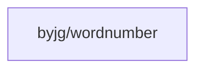

# WordNumber

[](https://github.com/byjg/php-wordnumber/actions/workflows/phpunit.yml)
[](http://opensource.byjg.com)
[](https://github.com/byjg/php-wordnumber/)
[](https://opensource.byjg.com/opensource/licensing.html)
[](https://github.com/byjg/php-wordnumber/releases/)

Convert numeric values into their word representations in multiple languages.

## Features

- Convert integers and floats to word numbers
- Support for multiple languages:
  - English
  - Portuguese
  - Italian (Thanks to [willypuzzle](https://github.com/willypuzzle))
- Currency formatting with singular/plural forms
- Extensible architecture for adding new languages

## Installation

```bash
composer require byjg/wordnumber
```

## Quick Start

### English

```php
use ByJG\WordNumber\EnglishWordNumber;

$wordNumber = new EnglishWordNumber();
echo $wordNumber->write(12.34);
// Output: twelve dollars and thirty four cents
```

### Portuguese

```php
use ByJG\WordNumber\PortugueseWordNumber;

$wordNumber = new PortugueseWordNumber();
echo $wordNumber->write(12.34);
// Output: doze reais e trinta e quatro centavos
```

### Italian

```php
use ByJG\WordNumber\ItalianWordNumber;

$wordNumber = new ItalianWordNumber();
echo $wordNumber->write(12.34);
// Output: dodici euro e trenta quattro centesimi
```

## Documentation

- [Getting Started](docs/getting-started.md)
- [Usage Examples](docs/usage.md)
- [Creating Custom Languages](docs/creating-languages.md)

## Dependencies



----
[Open source ByJG](http://opensource.byjg.com)
