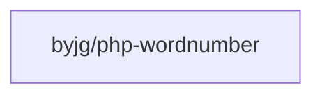

# Wordnumber

[](https://github.com/byjg/php-wordnumber/actions/workflows/phpunit.yml) 
[](http://opensource.byjg.com) 
[](https://github.com/byjg/php-wordnumber/) 
[](https://opensource.byjg.com/opensource/licensing.html) 
[](https://github.com/byjg/php-wordnumber/releases/)

Write float number in a word number.

Support multiple languages. Until this moment supports

 - English
 - Portuguese
 - Italian (Thanks to [willypuzzle](https://github.com/willypuzzle))

# Examples

```php
$wordNumber = new \ByJG\WordNumber\EnglishWordNumber();
$wordnumber->write(12.34);  # writes twelve dollars and third four cents
```

or

```php
$wordNumber = new \ByJG\WordNumber\PortugueseWordNumber();
$wordnumber->write(12.34);  # writes doze reais e trinta e quatro centavos.
```

# Create other languages

You have to implement the interface WordNumberInterface with the proper word number in your language.
If you create feel free to send to us.

```php
interface WordNumberInterface
{
    public function concatWord();

    public function currency();

    public function tens();

    public function unit();

    public function elevenToNineteen();

    public function twentyToNinety();

    public function hundreds();

    public function oneHundred();
}
```

## Dependencies



----  
[Open source ByJG](http://opensource.byjg.com)
